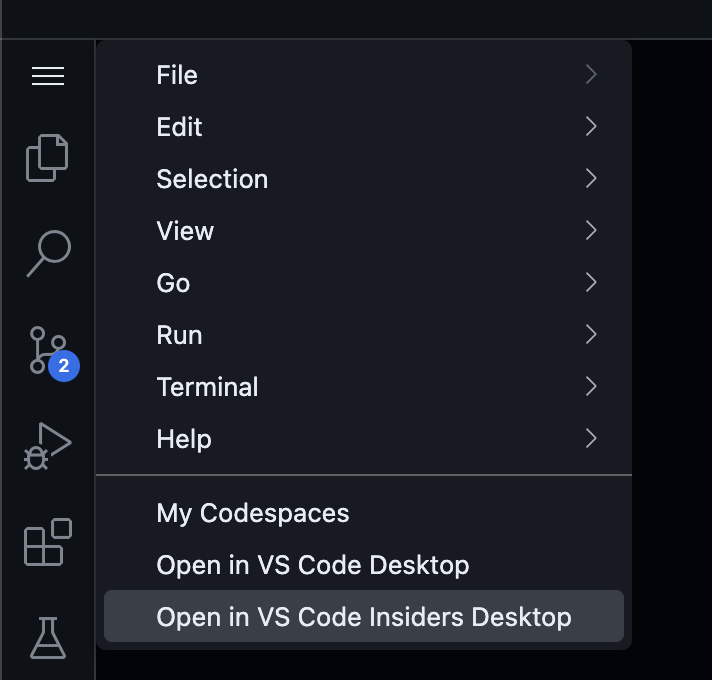

# Github copilot
## Chat
- You can open the Copilot chat via the icon

- You can use prompt techniques we explained.
- You can find inspiration for specific ecosystem prompts at <https://cursor.directory/rules>

## Experimental features - VSCode Insiders
- There a way more features that we can configure with prompts.
- Maybe of them are experimental and require the expirmental VSCode version - VSCode Insiders
- In a codespace you switch to that version: select the left corner menu

- Settings can be found under the menu.

## Global Custom instructions
- You can configure a prompt that is added to every requests
- This is similar to the system prompt we explained
- We need to enable it in the settings via `"github.copilot.chat.codeGeneration.useInstructionFiles": true
`
- Put it `.github/copilot-instructions.md`


More information at : <https://docs.github.com/en/copilot/customizing-copilot/adding-repository-custom-instructions-for-github-copilot#creating-a-repository-custom-instructions-file
>

## Extra instructions for chat
### Code generation
- We can also stear how code gets generated from chat.
- Note: this does not influence code completion

```
 "github.copilot.chat.codeGeneration.instructions": [
    {
      "text": "Always add a comment: 'Generated by Copilot'."
    },
    {
      "text": "In TypeScript always use underscore for private field names."
    },
    {
      "file": "code-style.md" // import instructions from file `code-style.md`
    }
  ],
```

code-style.md
```
Always use React functional components.
Always add comments.
```

More info at:  <https://code.visualstudio.com/docs/copilot/copilot-customization#_define-codegeneration-custom-instructions>

You can also use code examples in there :
See <https://code.visualstudio.com/blogs/2025/03/26/custom-instructions#_one-more-thing>


## More custom instructions settings

See : https://code.visualstudio.com/docs/copilot/copilot-customization#_prompt-files-experimental-settings

- `github.copilot.chat.codeGeneration.useInstructionFiles`: controls whether code instructions from .github/copilot-instructions.md are added to Copilot requests.
- `github.copilot.chat.codeGeneration.instructions` (Experimental): set of instructions that will be added to Copilot requests that generate code.
- `github.copilot.chat.testGeneration.instructions` (Experimental): set of instructions that will be added to Copilot requests that generate tests.
- `github.copilot.chat.reviewSelection.instructions` (Preview): set of instructions that will be added to Copilot requests for reviewing the current editor selection.
- `github.copilot.chat.commitMessageGeneration.instructions` (Experimental): set of instructions that will be added to Copilot requests that generate commit messages.
- `github.copilot.chat.pullRequestDescriptionGeneration.instructions` (Experimental): set of instructions that will be added to Copilot requests that generate pull request titles and descriptions.


## Reusable prompts

- `chat.promptFiles` (Experimental): enable prompt file locations. Use the { "/path/to/folder": boolean } format.
- by default they go into into `.gitub/prompts/`
- Write prompt instructions by using Markdown formatting.
- Within a prompt file, reference additional workspace files as Markdown links ([index](../index.ts)), or as #file:../index.ts references within the prompt file.
- You can also reference other .prompt.md files to create a hierarchy of prompts, with reusable prompts that can be shared across multiple prompt files.

- Attach a prompt file to a chat request
- Select the Attach Context  icon (⌘/), and then select Prompt....
- Alternatively, use the Chat: Use Prompt command from the Command Palette (⇧⌘P).


## Add images to the prompt
- Use the `paperclip` icon (Add Context) to add it to the prompt.
- Or copy and paste an image into it.
- Note: images don't work with all models.

## Different models
- We can also switch models : by default Copilot chat uses `gpt-4o` but you can also switch to `Claude` models.

- More info at : <https://docs.github.com/en/copilot/using-github-copilot/ai-models/changing-the-ai-model-for-copilot-code-completion?tool=visualstudio#enabling-the-model-switcher>

## Next Edit Suggestion
- `github.copilot.nextEditSuggestions.enabled` : When you're presented with an edit suggestion, navigate to it with the Tab key and then accept it with the Tab key again. Forget about manually searching through related files or references. Copilot NES will keep tabs on your next relevant edit!

- More information at : <https://code.visualstudio.com/blogs/2025/02/12/next-edit-suggestions#_getting-started-with-nes>