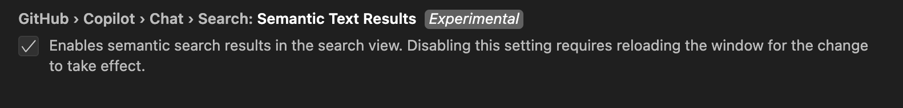

# Github copilot
## Workspace code

Your full VS Code workspace can be too large to pass entirely to GitHub Copilot for responding to your chat prompt. Instead, @workspace extracts the most relevant information from the different context sources to ground Copilot's answer.

First, @workspace determines which information is needed to answer your question, also including the conversation history, workspace structure, and currently selected code.

Next, it collects the context using different approaches, such as finding relevant code snippets by searching locally or by using GitHub's code search, and using VS Code's language IntelliSense to add details like function signatures, parameters, and more.

More info at <https://code.visualstudio.com/docs/copilot/workspace-context>

## Code Indexing

Copilot uses an index to quickly and accurately search your codebase for relevant code snippets. This index can either be maintained by GitHub or stored locally on your machine. This section covers the different types of indices that Copilot can use (remote, local, and basic), and explains when each one is used and how you can switch between them.

More info at : < https://code.visualstudio.com/docs/copilot/workspace-context#_managing-the-workspace-index
>

`github.copilot.chat.codesearch.enabled`

## Enable Semantic search 
Now you can also enable semantic related search: Include search results from Copilot in the Search view that are semantically relevant. `

Setting : `github.copilot.chat.search.semanticTextResults`

More info at <https://github.blog/changelog/2025-03-12-instant-semantic-code-search-indexing-now-generally-available-for-github-copilot/>
